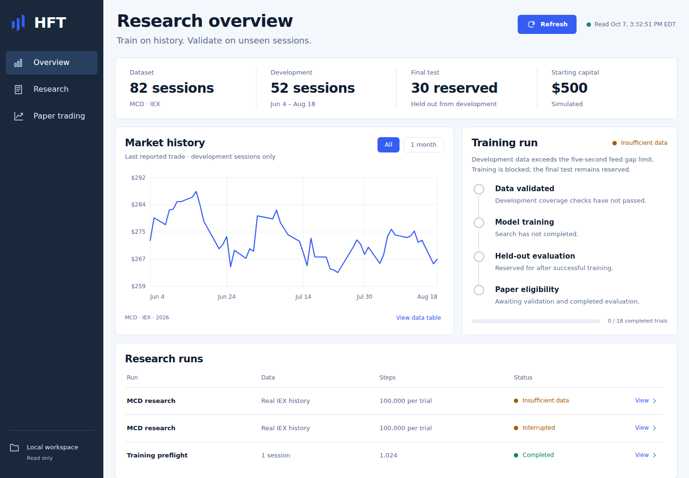
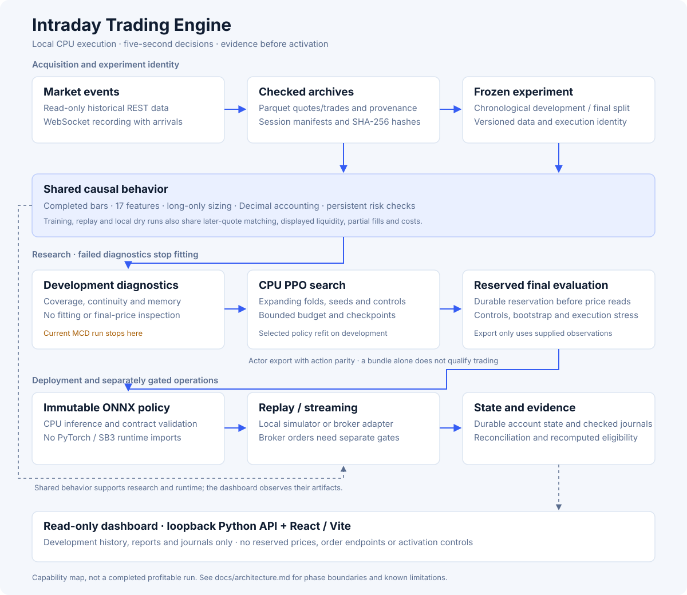

# Intraday Trading Engine

[](https://github.com/dpologdvinity/intraday-trading-engine/actions/workflows/ci.yml)

A local, CPU-only research system for intraday stock trading. It replays historical
quote and trade events through a causal execution simulator, trains PPO policies
against it, evaluates them on reserved unseen sessions, and deploys the selected
policy as an immutable ONNX bundle for replay, local dry runs and gated
Alpaca paper trading. Decisions are made every **5 seconds**; this is intraday
research infrastructure, not colocated submillisecond execution.

**Python · C++20 / pybind11 · PyTorch / Stable-Baselines3 · Gymnasium · ONNX Runtime · PyArrow / Parquet · React / Vite**

> **Status:** the engineering platform is implemented and tested. The current real-data
> experiment (82 MCD sessions) is blocked by measured feed gaps in the development
> data, so no model has qualified for trading. The system reports that honestly
> rather than training on unusable data.



The screenshot shows actual local research artifacts. The chart is development-session
trade history, not strategy returns; the $500 allocation is simulated.
[Demo walkthrough and more screenshots](docs/demo.md).

## Engineering highlights

- **One causal execution contract.** Training, replay and live dry runs share the same
  five-second bar publication, 17-feature observation, quote-level partial fills with
  modeled latency and costs, Decimal accounting and persistent risk limits. Fills need
  a genuine later quote; a bar close cannot invent liquidity.
- **Leakage-guarded evaluation.** Chronological expanding folds, multiple seeds and
  cost-matched controls (cash, intraday long, EMA crossover, 20 random policies,
  paired block bootstrap). Final-test dates are durably reserved before their prices
  can be opened, and regression tests fail if the loader's preflight or read stages touch a
  reserved partition.
- **C++ market-data and decision engine.** `hftcore` (C++20, pybind11, CMake,
  Catch2, CI) ports the causal 5-second bar aggregator and the market engine: decision
  history, feed-gap and warmup rules, the 10 market features and rule strategies.
  Parity tests require bit-identical output to the Python reference, down to CPython
  3.12's compensated float sum and no fused multiply-adds. Replaying a real 5.1M-quote
  NVDA session takes **1.3 s instead of 111.5 s (86×)** with identical bars; per-event
  latency is **71 ns p50** and tick-to-decision **12.7 µs p50** after replacing a
  string hash set with an allocation-free 128-bit identity set. A simdjson stream
  parser goes from raw Alpaca JSON to a decision in **~1 µs p50**. The paper bot and
  backtests use the C++ engine automatically; CI runs every test on it and the C++
  unit tests under AddressSanitizer/UBSan
  ([design](docs/specs/2026-10-07-paper-trading-runner-design.md), [engine](cpp/README.md)).
- **Measured performance work.** Profiling showed a memory-budget scan dominated
  session loading. Fixing it and loading an execution-only metadata view made a
  5.1M-quote session load **10× faster** with **63% less retained memory** and a
  **33% lower peak RSS** (single runs), with identical bars, gaps and decision
  eligibility; full trading rollouts were identical on a smaller session.
  [Results and method](docs/performance-results.md).
- **Honest data diagnostics.** Development-only inspection of 240,160 decisions across
  52 sessions found 57,049 feed gaps, blocking training before any fit.
  [Measured readiness results](docs/research-readiness-results.md).
- **Safe deployment path.** Hash-verified ONNX bundles with action-parity checks;
  inference never imports the training stack. Broker paper trading uses durable
  client order IDs, reconciliation and fail-closed risk latches; live trading needs
  explicit activation, graduation evidence and a $10 canary cap.
- **Read-only operator dashboard.** Loopback-only API with Host/Origin validation and
  a responsive React UI that shows stale and empty states truthfully.

## Architecture



| Area | Modules |
| --- | --- |
| Data and provenance | `data.py`, `history.py`, `recording.py`, `calendar.py` |
| Causal feed and execution | `feed.py`, `execution.py`, `account.py`, `sizing.py`, `risk.py` |
| Learning and research | `features.py`, `env.py`, `training.py`, `research.py`, `metrics.py`, `evidence.py` |
| Deployment and runtime | `policy.py`, `runtime.py`, `paper.py`, `broker.py`, `state.py`, `logs.py` |
| Operator interface | `cli.py`, `dashboard.py`, `frontend/` |

[Module boundaries and data flow](docs/architecture.md).

## Quick start

Requires Python 3.12 and, for the dashboard, Node.js 22. No credentials or market
data are needed for the offline check.

```bash
python3.12 -m venv .venv
source .venv/bin/activate
python -m pip install -r requirements-train.txt   # pinned CPU-only stack
python -m pip install --no-deps -e .
python -m hft smoke --output artifacts/my-smoke
```

The smoke command trains PPO on explicitly synthetic sessions, exports and verifies
an ONNX bundle, and replays it through the quote-level simulator. Its report is
labeled `research-only` and can never qualify a policy. Use a new output directory
for each run. For inference only, install `requirements-runtime.txt` instead; the
runtime imports neither Torch nor Stable-Baselines3.

### Verify

```bash
python -m pytest -q                      # 218 tests, synthetic fixtures only
ruff check hft tests benchmarks scripts && ruff format --check hft tests benchmarks scripts
npm --prefix frontend ci && npm --prefix frontend test && npm --prefix frontend run build
```

CI runs the same checks plus the smoke run on pushes to `master` and on pull requests.

### Dashboard

```bash
npm --prefix frontend ci
npm --prefix frontend run build
python -m hft dashboard
```

Open <http://127.0.0.1:8765>. The dashboard binds to loopback, is read-only, never
reads reserved final-test prices and has no order or activation controls. A fresh
clone shows empty states until local data and experiments exist.

## Paper trading on your chosen stocks

Trade any 1-30 stocks on your Alpaca **paper** account (simulated money), each with
its own dollar budget, every trading day until you stop it:

```bash
export ALPACA_API_KEY=... ALPACA_SECRET_KEY=...              # free market data
export ALPACA_PAPER_API_KEY=... ALPACA_PAPER_SECRET_KEY=...  # paper account
python -m hft trade --paper --symbols NVDA=200 AAPL=100 MSFT=100 --strategy ema-crossover
python -m hft trade --status                                  # per-stock position and profit
python -m hft trade --replay 2026-10-07 --symbols NVDA=100 AAPL=100   # rerun a past day
```

`--replay` downloads that day's IEX quotes once (read-only) and runs each stock through
the same engine, strategy, sizing and risk limits with simulated quote-level fills; it
shows what the bot would have done, not broker results.

Strategies: `ema-crossover`, `hold-day`, or `model:<bundle>` (a trained model, for
the stock it was trained on). The run waits for the open, trades, goes flat before
the close and repeats daily; Ctrl-C cancels orders, sells holdings and reconciles.
Each stock has its own ledger and order book on one dedicated paper account; feed
silence or a disconnect blocks new entries instead of stopping the run, and daily
loss (2%) and drawdown (5%) limits apply per stock and across the account. New
entries wait while the IEX bid-ask spread is wider than 10 bp (`--max-spread-bps`):
thin IEX books post quotes far from the real market, so prefer liquid names such as
NVDA or AAPL (about 2 bp). Exits are never blocked by spread. Real money is refused
until a strategy passes research and 30 paper sessions.

## Research workflow

```bash
python -m hft download --symbol AAPL --start 2026-03-01 --end 2026-06-30 --output data/aapl
python -m hft experiment --dataset data/aapl/manifest.json --config config/research.toml --output artifacts/aapl/experiment.json
python -m hft data-quality --experiment artifacts/aapl/experiment.json --all-development
python -m hft train --experiment artifacts/aapl/experiment.json
python -m hft report --experiment artifacts/aapl/experiment.json
python -m hft replay --model artifacts/aapl/search/bundle --dataset data/aapl/manifest.json
```

Downloading uses free IEX data through your own Alpaca market-data credentials
(read-only endpoints). The [operations guide](docs/operations.md) covers data
acquisition and recording, experiment freezing, training budgets, diagnostics,
replay, dry runs, broker paper trading, graduation and live activation.

## Documentation

- [Operations guide](docs/operations.md): commands and operating contracts.
- [Trading specification](docs/trading-spec.md): execution, risk, research and graduation contracts.
- [Architecture](docs/architecture.md) and [demo walkthrough](docs/demo.md).
- [Performance results](docs/performance-results.md), [replay results](docs/replay-results.md), [development readiness results](docs/research-readiness-results.md)
  and [free-data suitability results](docs/free-data-suitability-results.md).
- [Research roadmap](docs/research-improvement-roadmap.md) and [dashboard design system](DESIGN.md).

## Limitations

- No model has qualified; the current development data fails continuity checks.
  Passing engineering tests does not establish a trading edge.
- Free IEX data is one exchange's feed, not consolidated NBBO or a full order book.
- Historical replay cannot prove live network latency; broker fee and fractional
  order behavior still need a real paper-account integration run.
- Stocks only, long-only fractional positions, no leverage or shorting.

## License

[MIT](LICENSE).
