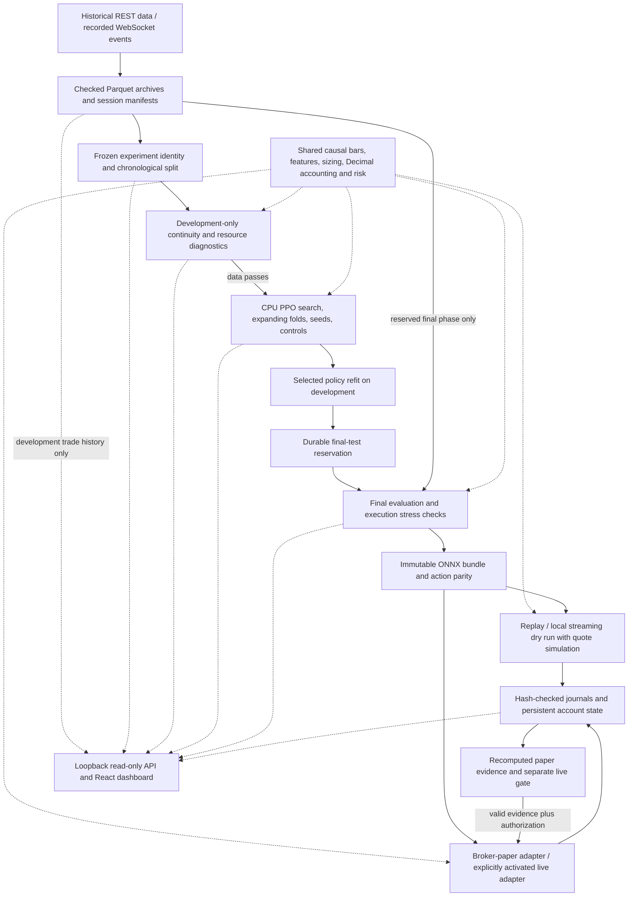

# Architecture

HFT is a local, stocks-only intraday research platform with five-second decisions.
It connects archived market events to reproducible PPO research and separately
gated trading workflows. The current MCD experiment stops at development data
diagnostics; the downstream capabilities below do not imply a qualified model.

## Editable flow

This Mermaid diagram captures the component relationships. Solid arrows show
data or execution flow; dotted arrows show observation or shared implementation.
The static SVG above is the presentation version.

This is a capability map rather than the chronological record of a completed
run. Failed preflight blocks fitting. Export is available for engineering checks;
a bundle alone does not establish paper eligibility.

## Responsibilities and boundaries

| Layer | Modules | Responsibility |
| --- | --- | --- |
| Acquisition and recording | `history.py`, `recording.py`, `calendar.py` | Read-only historical acquisition, recorded arrivals, exchange sessions, resume/checkpoints |
| Archive validation | `data.py` | Exact timestamps, provenance, hashes, partition integrity, resident/transient limits |
| Shared causal behavior | `feed.py`, `features.py`, `sizing.py`, `account.py`, `risk.py` | Boundary publication, 17 observations, long-only intents, fractional ledger, persistent risk checks |
| Local quote simulation | `execution.py`, `env.py`, `paper.py` | Later-quote matching, partial fills/costs, Gymnasium episodes, replay and dry runs |
| Research | `research.py`, `training.py`, `metrics.py` | Frozen identities, development preflight, chronological folds, CPU PPO, controls/statistics, final reservations |
| Model deployment | `policy.py` | Immutable ONNX bundles, deterministic actor parity, contract validation, inference without training imports |
| Runtime and broker | `runtime.py`, `broker.py`, `state.py` | Independent bounded intake, serialized order operations, durable recovery, account ownership/reconciliation |
| Evidence | `logs.py`, `evidence.py`, `configuration.py` | Checked journals, reconstructed results, expiring qualification and deliberate activation |
| Presentation | `dashboard.py`, `frontend/src/` | Loopback API, approved artifact reads, development history, responsive read-only UI |
| Operator entry point | `cli.py` | Explicit commands and configuration; training/broker imports only in relevant workflows |

### Prices and research phases

Experiment freezing validates checked manifests without opening Parquet prices.
Development diagnostics load one session at a time. Ordinary search loads
development prices; final prices load after the project-wide reservation and
persisted consumption marker. Final-test dates cannot be reused by changing
experiment output paths. The dashboard excludes reserved final-test prices.

Bundle export never loads market data itself: callers must supply observations
from an authorized evaluation, and export rejects missing observations before
reading any checkpoint or archive. See the [current roadmap](research-improvement-roadmap.md).

### Simulation and actual broker fills

Training, replay, and local dry runs share quote-level simulated execution:
real later quotes, displayed sizes, partial fills, limits, latency, and costs.
Broker workflows use actual broker executions and reconcile them into accounting.
They share causal features, sizing, and risk behavior, but broker fills are not
manufactured by the local simulator.

### Deployment and state

The trained actor exports to ONNX with exact action-parity verification. Its
manifest binds model identity to feature, aggregation, market, and execution
contracts. ONNX Runtime executes on CPU without importing PyTorch or
Stable-Baselines3. Durable state and account-specific locks protect ownership
across restarts; acknowledgements alone do not change inventory.

### Observation and authorization

The dashboard is an observer. It has no order endpoints or activation controls,
requires no credentials for existing artifacts, and binds to loopback. Runtime
broker commands are separate entry points. Real paper evidence and deliberate
operator activation remain prerequisites for the live path.

## Current measured stopping point

All 52 inspected MCD development sessions failed the five-second continuity
contract. The diagnostic run counted 2,054 eligible and 238,106 ineligible
decisions, with 57,049 gaps. No v3 trial was fitted; 30 final sessions remain
reserved in the captured experiment. [Measured results](research-readiness-results.md)
document the workload and its memory limits. The [demo](demo.md) shows this
stopping point in the UI.

Mermaid syntax follows the [official flowchart documentation](https://mermaid.js.org/syntax/flowchart.html)
and [accessibility directives](https://mermaid.js.org/config/accessibility.html).
