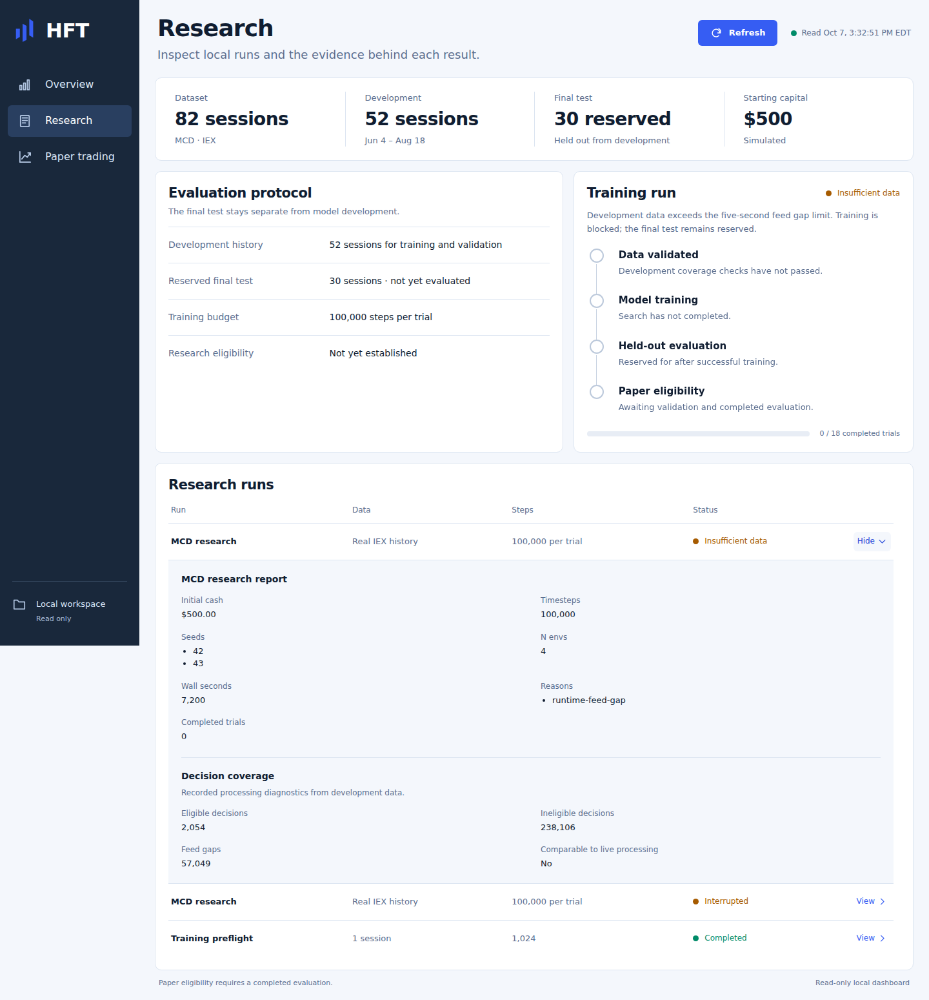
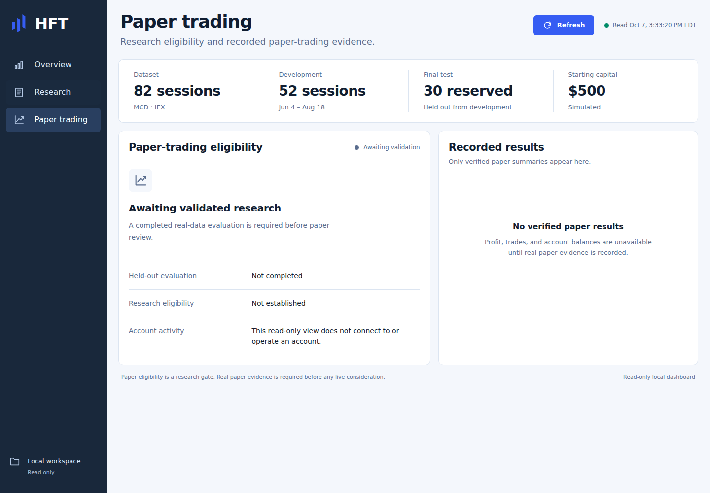
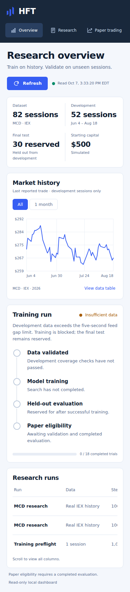

# Project demo

This is a five-minute tour of the implemented research platform. The screenshots
show the actual local MCD experiment on October 7, 2026. They demonstrate data
inspection and engineering safeguards; no profitable model or broker trading
result is established.

## Start the local dashboard

From the repository root, with the existing Python environment and frontend
dependencies installed:

```bash
npm --prefix frontend run build
.venv/bin/python -m hft dashboard --port 8765
```

Open <http://127.0.0.1:8765>. If a dashboard already runs on that port, use it
instead of starting another. The dashboard reads existing local artifacts and
does not require credentials, download data, fit models, or submit orders.

For a fresh clone, follow the [installation instructions](../README.md#offline-engineering-check),
using `requirements-runtime.txt` if you only need the dashboard, and install
frontend dependencies with `npm --prefix frontend ci`. Generated `data/`,
`artifacts/`, `logs/`, and `.state/` are excluded from Git. A fresh clone displays
honest empty states; it will not reproduce the populated screenshots without
the corresponding real archive and experiment. Use the screenshot tour below
for a portable presentation. The synthetic smoke check is separate engineering
proof and does not populate the real-data dashboard.

## Five-minute walkthrough

| Time | Show | Explain |
| --- | --- | --- |
| 0:00–0:45 | Overview: archive and split | “The local archive contains 82 real stock sessions. Fifty-two are development data; thirty remain reserved for final evaluation.” |
| 0:45–1:30 | Market history, **1 month**, **View data table** | “The chart and accessible table show actual development-session last trades. They are market prices, not the policy's returns.” |
| 1:30–2:30 | Research: **View** on the insufficient-data MCD run | “The diagnostics inspected 240,160 decisions and found 57,049 feed gaps. Training stopped before fitting because the data violates the shared execution contract.” |
| 2:30–3:00 | Paper trading | “Missing research and paper evidence remain visibly unavailable. This screen cannot place orders or activate trading.” |
| 3:00–4:15 | [Architecture diagram](architecture.md) | “Training, replay, and local dry runs share causal features, sizing, accounting, risk checks, and quote matching. An exported actor runs through ONNX without importing the training stack.” |
| 4:15–5:00 | Narrow viewport and **Refresh** | “The same reports work on mobile. Failed reads retain a labeled stale snapshot; the server remains local and read-only.” |

Those counts describe the captured MCD v3 run. Later local diagnostics can differ,
so use the displayed evidence and its coverage rather than assuming every report
contains the same full inspection.

## Screenshots

All four images were captured from the production build served by the existing
Python dashboard, without response stubs or invented data. Desktop viewport:
1440×1000. Mobile viewport: 392×844. Research and mobile captures include the
full page; image height therefore exceeds viewport height. The timestamp in
the header is the API read time, not a live market-feed timestamp.

### Overview


The overview ties market history to the recorded research status. Zero completed
trials and reserved final sessions are visible alongside the simulated capital.

### Expanded research evidence



The expanded report separates requested training settings from completed work.
Eligible decisions here mean contiguous feature warmup, not executable trades.
The separate older preflight row proves pipeline execution only.

### Paper evidence



The empty results are intentional: no recorded broker-paper results exist for
this demo. Eligibility, account activity, and realized trading performance are
different concepts.

### Mobile overview



The document has no horizontal overflow. Wide research tables retain their
columns in an independently scrollable region.

## Engineering points to discuss

- **Causality:** completed bars and genuine later quotes govern decisions and
  fills; a bar close cannot invent executable liquidity.
- **Research integrity:** ordinary setup loads development prices only. Final
  evaluation reserves dates durably before loading them, and model export only
  uses observations supplied by an authorized evaluation.
- **Failure diagnosis:** complete diagnostic coverage is distinct from passing
  coverage. Extra PPO steps cannot repair a dataset's continuity failures.
- **Deployment:** immutable model bundles carry feature/execution identities
  and action-parity checks; inference has separate dependencies from training.
- **Reliability:** persisted order IDs, fill-based accounting, bounded intake,
  reconciliation, and risk latches protect restart behavior.

## Reproduce the captures

Serve the production build with the dashboard command above, then capture each
view in a headless browser at 1440×1000 (desktop) and 392×844 (mobile, full page).
Wait for the real dataset and status to load before capturing, and check the
browser console for errors. Preserve unavailable results and real statuses; do
not mutate experiments or seed a successful account for presentation. Capture
file hashes and the source experiment identity are recorded in
[images/capture-manifest.json](images/capture-manifest.json).
